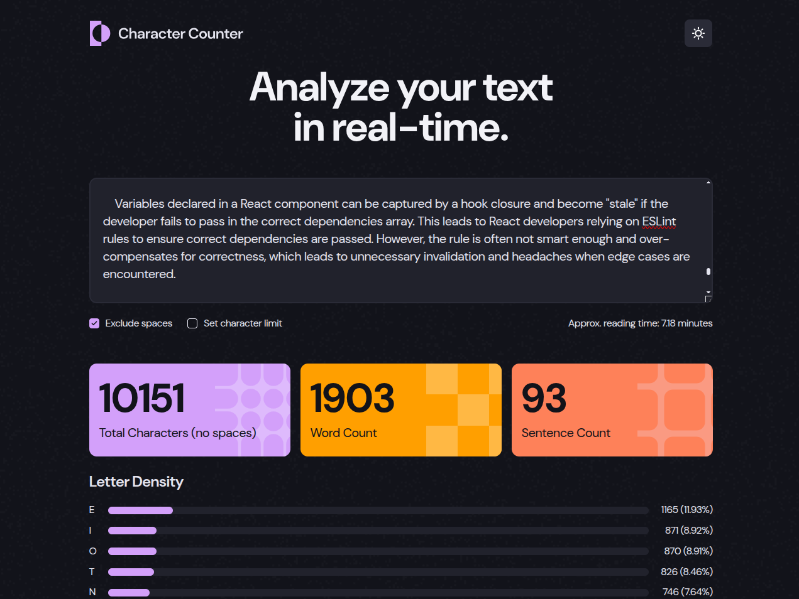

# Character counter

## Table of contents

- [Overview](#overview)
  - [The challenge](#the-challenge)
  - [Screenshot](#screenshot)
  - [Links](#links)
- [My process](#my-process)
  - [Built with](#built-with)
- [Author](#author)

## Overview

### The challenge

Users should be able to:

- Analyze the character, word, and sentence counts for their text
- Exclude/Include spaces in their character count
- Set a character limit
- Receive a warning message if their text exceeds their character limit
- See the approximate reading time of their text
- Analyze the letter density of their text
- Select their color theme
- View the optimal layout for the interface depending on their device's screen size
- See hover and focus states for all interactive elements on the page

### Screenshot

### Links

- [Solution](https://github.com/kxrn0/character_counter)
- [Live](https://kxrn0.github.io/character_counter/)

## My process

### Built with

- Semantic HTML5 markup
- CSS custom properties
- Flexbox
- [Typescript](https://www.typescriptlang.org/)
- [Vue](https://vuejs.org/)
- [Sass](https://sass-lang.com/)
- [Vite PWA plugin](https://vite-pwa-org.netlify.app/)

## Author

kxrn0 - [github](https://github.com/kxrn0/)
